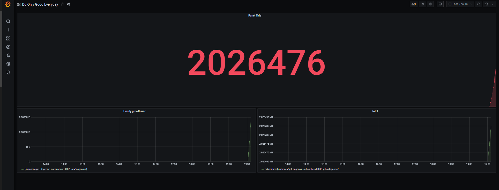
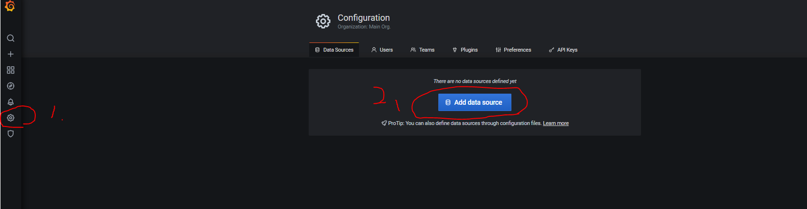
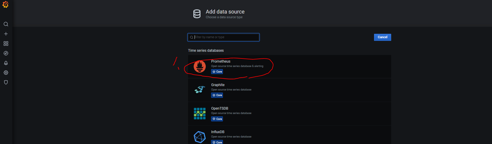
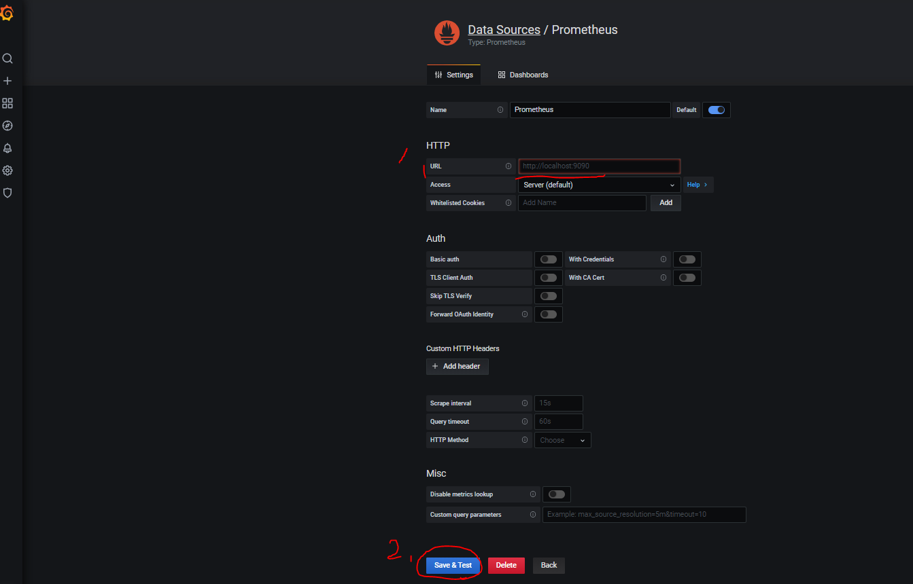
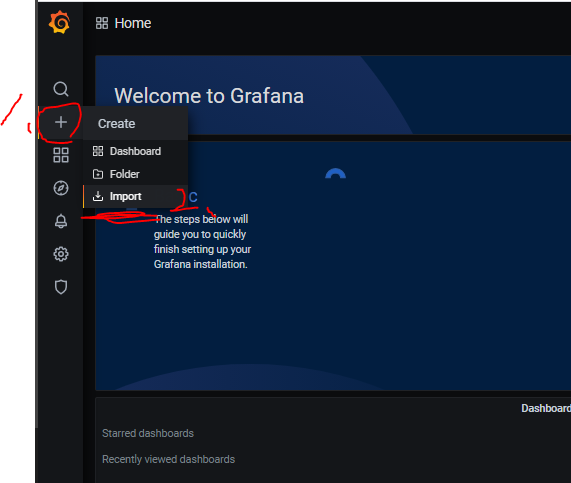
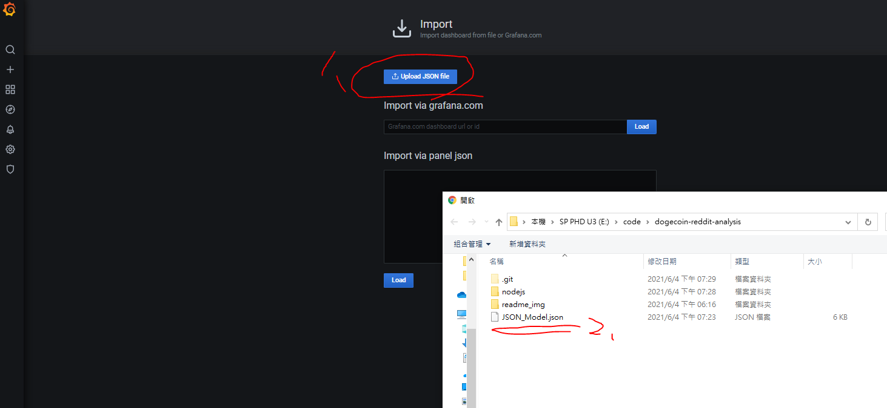

# Analysis dogecoin reddit subscribers 

## [Go to see our subscribers number increasing](http://www.dogecoin.idv.tw/)

## What is it?
This is to see the increase in the number of our subscribers.

## How to build

1. Clone project
2. Change password `GF_SECURITY_ADMIN_PASSWORD: 42069` in docker-compose.yml
3. Run `docker-compose up -d --build`
4. Open web on 80 port
5. Login user is `admin`, password is which you set in `step 2`
6. Link Prometheus

    1. 
    

    2. 
    

    3.  type `http://prometheus:9090` in URL row
    

7. Import dashboard 

    1. 
    

    2. Choose `JSON_Model.json` file which I put it in this project.
    

8. Complete

