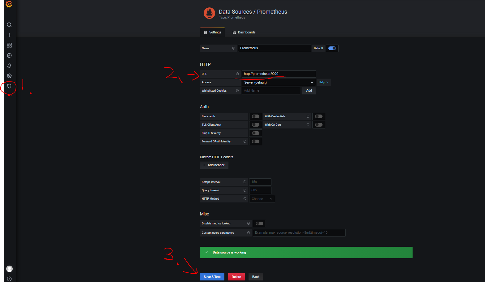
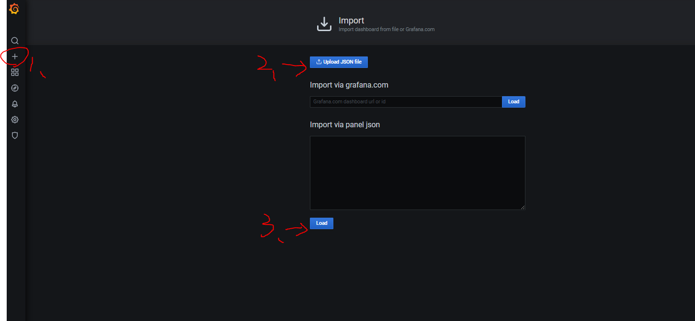

# dogecoin reddit subscribers analysis

## What is it?
This is to see the increase in the number of our subscribers.

## How to build

1. Clone project
2. Change `password` in docker-compose.yml
3. Run docker-compose up -d
4. Open web on 80 port
5. Login user is `admin`, password is which you set in `step 2`
6. Link Prometheus, type in `http://prometheus:9090` in URL row

7. Import dashboard ( choose `JSON_Model.json` file when `2.`
 I put it in this project.)

